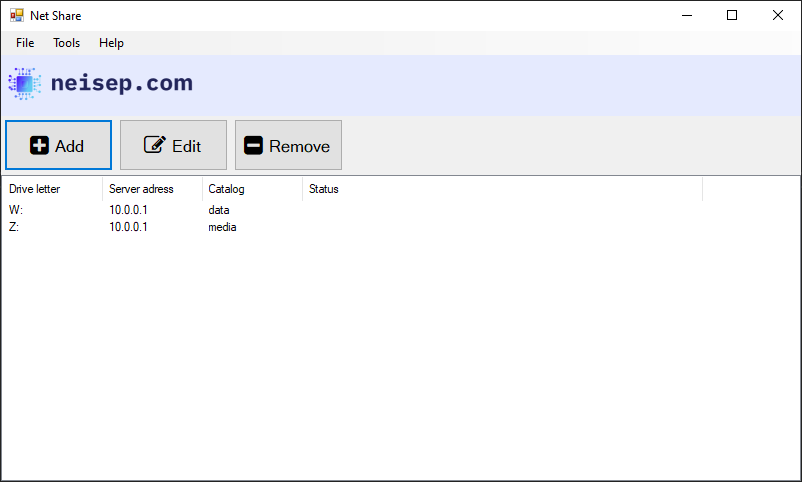

# 🖥️ NetShare

A simple **GUI tool for managing SMB shares on Windows**.  
NetShare helps you securely store your network shares and automatically mount them when Windows starts up.

---

## ✨ Features
- Easy-to-use graphical interface for SMB shares
- Save and manage multiple network shares
- Automatic mounting at Windows startup
- Built with .NET for Windows environments

---

## 📦 Installation
Download the latest release from the [Releases page](https://github.com/neisep/netshare/releases).

1. Extract the files to your preferred location.
2. Run the executable to launch NetShare.
3. Add your SMB shares through the GUI.

---

## 🛠 Usage
1. Open **NetShare**.
2. Add a new SMB share by entering:
   - Network path (e.g., `\\server\share`)
   - Credentials (if required)
3. Save the share.  
   NetShare will automatically mount it

---

## 📸 Screenshot

---

## 🤝 Contributing
Contributions are welcome!  
- Fork the repository  
- Create a feature branch  
- Submit a pull request  

Check out the [issues](https://github.com/neisep/netshare/issues) page for ideas or bugs to fix.

---

## 📄 License
This project is licensed under the **GPL-3.0 License**.  
See the [LICENSE](LICENSE) file for details.

---

## 📬 Contact
Created by [neisep](https://github.com/neisep).  
Feel free to open an issue or reach out for suggestions and improvements!
